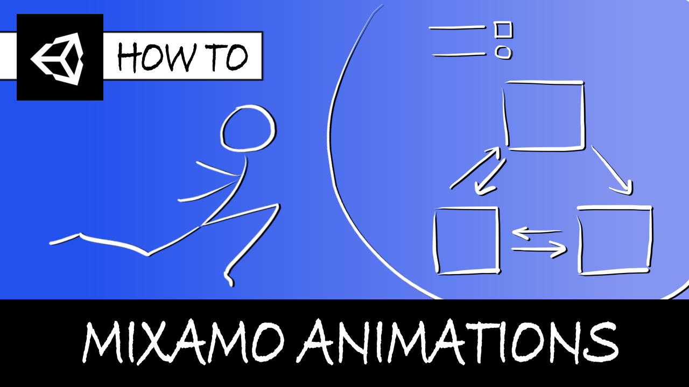

# [Unity/C#] Animating a simple player character in Unity with Mixamo!

**Mina Pêcheux - March 2022**

Did you know you can get free rigged models, poses and animations on [Adobe Mixamo](https://www.mixamo.com/)? And that you can then import them easily in Unity to quickly setup a basic player character with a few movements? Let's discover more in this video/text tutorial: "Animate a Unity character thanks to Mixamo (Unity/C# tutorial)" :)

You can read it in text format [on Medium](https://mina-pecheux.medium.com/how-to-animate-and-move-a-simple-player-with-mixamo-and-unity-c-721470b54551), or watch it [on Youtube](https://youtu.be/8Pk7FI629O8).

In this less than 30 minutes-tutorial, I'm discussing what Mixamo is, how to download free animations from it and how to use the Unity Animator to combine those animations into a state machine and animate a player moved thanks to the Rigidbody physics!

This Github repo contains the `PlayerController` C# class that I code in the tutorial, as well as the Mixamo FBX animations and a few additional assets for the sample scene :)
